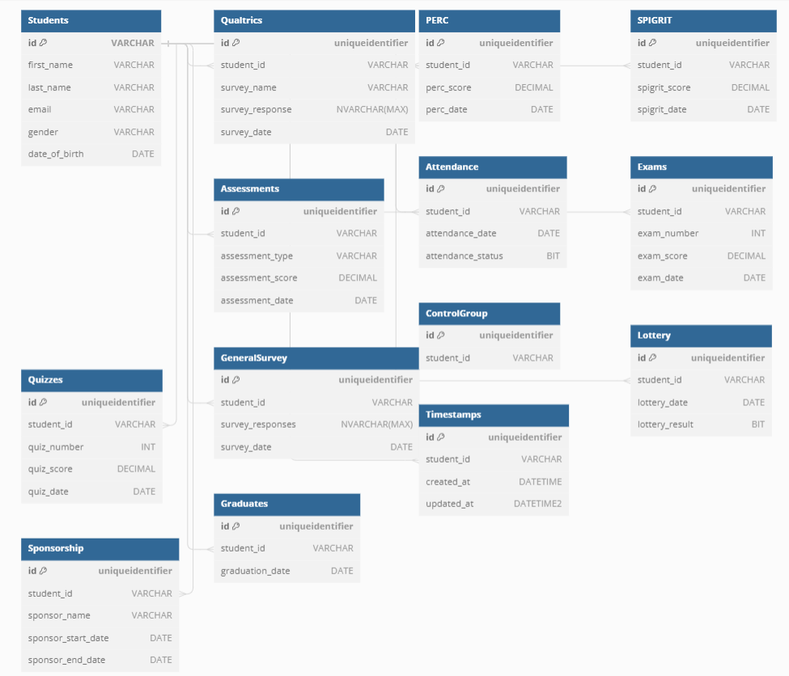

# EduVault

This project is a web application for managing users and integrating with Tally for data storage and retrieval. It includes front-end functionality, an API for user management, integration with Tally for data storage using webhooks, and an export functionality.

## Table of Contents

- [Demo Video](#demo-video)
- [API Documentation](#api-documentation)
- [Database Schema](#database-schema)
- [Tally Integration](#tally-integration)
- [Export Functionality](#export-functionality)

## Demo Video

[]()

## API Documentation

### User Management Endpoints

#### GET /users

- **Description**: Retrieves a list of all users.
- **Request Parameters**: None
- **Response**: 
  - **Status Code**: 200 OK
  - **Body**: Array of user objects

#### POST /users

- **Description**: Creates a new user.
- **Request Body**: JSON object containing user data (id, first_name, last_name, email, gender, date_of_birth)
- **Response**:
  - **Status Code**: 200 OK if successful, 500 Internal Server Error if an error occurs

#### GET /users/:id

- **Description**: Retrieves a user by ID.
- **Request Parameters**: User ID
- **Response**:
  - **Status Code**: 200 OK
  - **Body**: User object

### Webhook Endpoint

#### POST /webhook

- **Description**: Receives webhook payloads from Tally forms.
- **Request Headers**: 
  - `tally-signature`: Signature for verifying the source of the webhook payload
- **Request Body**: JSON object containing form data
- **Response**:
  - **Status Code**: 
    - 200 OK if successful
    - 401 Unauthorized if the signature verification fails
    - 500 Internal Server Error if an error occurs during processing

## Database Schema


```sql
CREATE TABLE [Students] (
  [id] VARCHAR(50) PRIMARY KEY UNIQUE,
  [first_name] VARCHAR(50),
  [last_name] VARCHAR(50),
  [email] VARCHAR(100) UNIQUE,
  [gender] VARCHAR(10),
  [date_of_birth] DATE
)
GO

CREATE TABLE [Qualtrics] (
  [id] uniqueidentifier PRIMARY KEY,
  [student_id] VARCHAR,
  [survey_name] VARCHAR,
  [survey_response] NVARCHAR(MAX),
  [survey_date] DATE
)
GO

CREATE TABLE [PERC] (
  [id] uniqueidentifier PRIMARY KEY,
  [student_id] VARCHAR,
  [perc_score] DECIMAL,
  [perc_date] DATE
)
GO

CREATE TABLE [SPIGRIT] (
  [id] uniqueidentifier PRIMARY KEY,
  [student_id] VARCHAR,
  [spigrit_score] DECIMAL,
  [spigrit_date] DATE
)
GO


CREATE TABLE [Assessments] (
  [id] uniqueidentifier PRIMARY KEY,
  [student_id] VARCHAR,
  [assessment_type] VARCHAR,
  [assessment_score] DECIMAL,
  [assessment_date] DATE
)
GO

CREATE TABLE [Attendance] (
  [id] uniqueidentifier PRIMARY KEY,
  [student_id] VARCHAR,
  [attendance_date] DATE,
  [attendance_status] BIT
)
GO

CREATE TABLE [Exams] (
  [id] uniqueidentifier PRIMARY KEY,
  [student_id] VARCHAR,
  [exam_number] INT,
  [exam_score] DECIMAL,
  [exam_date] DATE
)
GO

CREATE TABLE [Quizzes] (
  [id] uniqueidentifier PRIMARY KEY,
  [student_id] VARCHAR,
  [quiz_number] INT,
  [quiz_score] DECIMAL,
  [quiz_date] DATE
)
GO

CREATE TABLE [GeneralSurvey] (
  [id] uniqueidentifier PRIMARY KEY,
  [student_id] VARCHAR,
  [survey_responses] NVARCHAR(MAX),
  [survey_date] DATE
)
GO

CREATE TABLE [ControlGroup] (
  [id] uniqueidentifier PRIMARY KEY,
  [student_id] VARCHAR
)
GO

CREATE TABLE [Lottery] (
  [id] uniqueidentifier PRIMARY KEY,
  [student_id] VARCHAR,
  [lottery_date] DATE,
  [lottery_result] BIT
)
GO

CREATE TABLE [Sponsorship] (
  [id] uniqueidentifier PRIMARY KEY,
  [student_id] VARCHAR,
  [sponsor_name] VARCHAR,
  [sponsor_start_date] DATE,
  [sponsor_end_date] DATE
)
GO

CREATE TABLE [Graduates] (
  [id] uniqueidentifier PRIMARY KEY,
  [student_id] VARCHAR,
  [graduation_date] DATE
)
GO

CREATE TABLE [Timestamps] (
  [id] uniqueidentifier PRIMARY KEY,
  [student_id] VARCHAR,
  [created_at] DATETIME,
  [updated_at] DATETIME2
)
GO

ALTER TABLE [Qualtrics] ADD FOREIGN KEY ([student_id]) REFERENCES [Students] ([id])
GO

ALTER TABLE [PERC] ADD FOREIGN KEY ([student_id]) REFERENCES [Students] ([id])
GO

ALTER TABLE [SPIGRIT] ADD FOREIGN KEY ([student_id]) REFERENCES [Students] ([id])
GO

ALTER TABLE [Tally] ADD FOREIGN KEY ([student_id]) REFERENCES [Students] ([id])
GO

ALTER TABLE [Assessments] ADD FOREIGN KEY ([student_id]) REFERENCES [Students] ([id])
GO

ALTER TABLE [Attendance] ADD FOREIGN KEY ([student_id]) REFERENCES [Students] ([id])
GO

ALTER TABLE [Exams] ADD FOREIGN KEY ([student_id]) REFERENCES [Students] ([id])
GO

ALTER TABLE [Quizzes] ADD FOREIGN KEY ([student_id]) REFERENCES [Students] ([id])
GO

ALTER TABLE [GeneralSurvey] ADD FOREIGN KEY ([student_id]) REFERENCES [Students] ([id])
GO

ALTER TABLE [ControlGroup] ADD FOREIGN KEY ([student_id]) REFERENCES [Students] ([id])
GO

ALTER TABLE [Lottery] ADD FOREIGN KEY ([student_id]) REFERENCES [Students] ([id])
GO

ALTER TABLE [Sponsorship] ADD FOREIGN KEY ([student_id]) REFERENCES [Students] ([id])
GO

ALTER TABLE [Graduates] ADD FOREIGN KEY ([student_id]) REFERENCES [Students] ([id])
GO

ALTER TABLE [Timestamps] ADD FOREIGN KEY ([student_id]) REFERENCES [Students] ([id])
GO
```

The database schema consists of tables for storing user data, including fields such as ID, first name, last name, email, gender, and date of birth.

## Tally Integration

To integrate with Tally, the following steps were performed:

1. **Signed up in Tally**: Signed up for a Tally account to access their services.
2. **Created a Tally Form**: Created a form in Tally to collect user data.
3. **Created an Endpoint**: Implemented an endpoint in the API to receive webhook payloads from Tally.
4. **Verification of Source**: Implemented signature verification in the endpoint to ensure the authenticity of the data source.
5. **Data Extraction and Storage**: Extracted form data from the payload and stored it in the MSSQL database.
6. **Exposed Endpoint with ngrok**: Used ngrok to expose the local endpoint to the internet, allowing Tally to send webhook payloads.

## Export Functionality

The export functionality allows users to export data from the application. It works by querying the database for user data and generating a file in a specified format (e.g., CSV, Excel). Users can select the export format and download the file containing the requested data.

## Export Functionality

The `SingleStudent` component provides export functionality for student data in both spreadsheet (Excel) and CSV formats.
```javascript
import React, { useEffect, useState } from 'react';
import { useParams } from 'react-router-dom';
import axios from 'axios';
import { Avatar as MuiAvatar, Card as MuiCard, CardContent as MuiCardContent, CardHeader as MuiCardHeader, Typography, Button } from '@mui/material';
import * as XLSX from 'xlsx';
import { CSVLink } from 'react-csv';

const calculateAge = (dateOfBirthString) => {
    const dob = new Date(dateOfBirthString);
    const now = new Date();
    let age = now.getFullYear() - dob.getFullYear();
    if (
        now.getMonth() < dob.getMonth() ||
        (now.getMonth() === dob.getMonth() && now.getDate() < dob.getDate())
    ) {
        age--;
    }
    return age;
};

const SingleStudent = () => {
    const { id } = useParams();
    const [student, setStudent] = useState(null);

    useEffect(() => {
        const fetchStudent = async () => {
            try {
                const response = await axios.get(`http://localhost:3000/users/${id}`);
                const studentData = response.data[0];
                const age = calculateAge(studentData.date_of_birth);
                setStudent({ ...studentData, age });
            } catch (error) {
                console.error('Error fetching student data:', error);
            }
        };
        fetchStudent();
    }, [id]);

    const exportToSpreadsheet = () => {
        if (student) {
            const wb = XLSX.utils.book_new();
            const ws = XLSX.utils.json_to_sheet([student]);
            XLSX.utils.book_append_sheet(wb, ws, 'Student Data');
            XLSX.writeFile(wb, 'student_data.xlsx');
        }
    };

    return (
        <div className="px-4 mx-auto max-w-7xl flex flex-col items-center justify-center mt-8">
            {student && (
                <MuiCard className="w-full max-w-sm">
                    <div className="flex items-center justify-center p-6">
                        <MuiAvatar className="rounded-full" sx={{ width: 96, height: 96 }}>
                            {`${student.first_name.charAt(0)}${student.last_name.charAt(0)}`}
                        </MuiAvatar>
                    </div>
                    <MuiCardHeader
                        title={student.first_name}
                        subheader={`${student.age}-year-old ${student.gender}`}
                        className="text-center"
                    />
                    <MuiCardContent className="text-center">
                        <Typography variant="body1" className="text-sm/relaxed">
                            {`Loves playing the guitar and dreams of becoming a professional musician.`}
                        </Typography>
                    </MuiCardContent>
                </MuiCard>
            )}
            <Button onClick={exportToSpreadsheet} variant="contained" color="primary" className="mt-6" style={{ marginTop: '20px', backgroundColor: '#6A8165', color: 'white' }}>
                Export as Spreadsheet
            </Button>
            {student && (
                <CSVLink
                    data={[student]}
                    filename={'student_data.csv'}
                    className="mt-4"
                >
                    <Button variant="contained" color="primary" className="mt-4" style={{ backgroundColor: '#6A8165', color: 'white', }}>
                        Export as CSV
                    </Button>
                </CSVLink>
            )}
        </div>
    );
};

export default SingleStudent;
```

### Export to Spreadsheet Functionality

When the user clicks the "Export as Spreadsheet" button, the following process is executed:

1. The `exportToSpreadsheet` function is triggered.
2. It checks if the `student` state variable is not null.
3. If the `student` data is available, it creates a new Excel workbook (`wb`) using the `XLSX.utils.book_new()` function.
4. It converts the `student` data into a worksheet (`ws`) using the `XLSX.utils.json_to_sheet()` function.
5. The worksheet is then appended to the workbook using the `XLSX.utils.book_append_sheet()` function.
6. Finally, it saves the workbook as an Excel file named `'student_data.xlsx'` using the `XLSX.writeFile()` function.

### Export to CSV Functionality

The CSV export functionality is provided by the `CSVLink` component from the `react-csv` library. Here's how it works:

- The `CSVLink` component takes the `data` prop, which contains an array with the `student` data.
- The `filename` prop specifies the name of the CSV file to be downloaded, in this case, `'student_data.csv'`.
- When the user clicks the "Export as CSV" button, the CSV file containing the student data is downloaded.

These export functionalities allow users to save the student data locally in either Excel or CSV format for further analysis or processing.


## Conclusion

This README provides an overview of the project, including its components, functionalities, and integration with Tally for data storage. With this information, users can understand the project's purpose, features, and usage.
